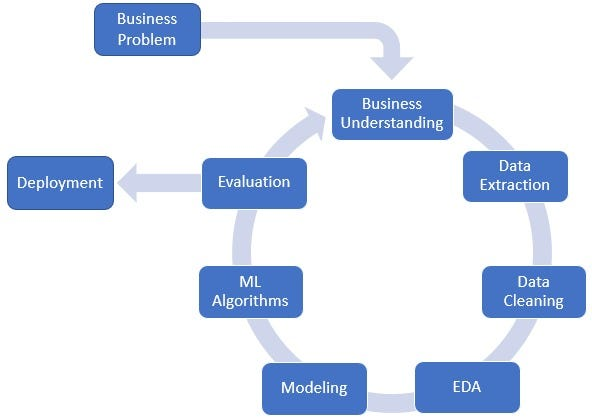

# PROJETO: ROSSMANN STORE - SALES PREDICT

A rede Rossmann opera mais de 3.000 farmácias em 7 países europeus. Atualmente, os gerentes das lojas Rossmann têm a tarefa de prever suas vendas diárias com até seis semanas de antecedência. As vendas das lojas são influenciadas por muitos fatores, incluindo promoções, competição, férias escolares e estaduais, sazonalidade e localidade. Com milhares de gerentes individuais prevendo vendas com base em suas circunstâncias únicas, a precisão dos resultados pode ser bastante variada. Como cientista de dados foi nos dado a tarefa de prever suas vendas diárias com até seis semanas de antecedência com uma precisão mais assertiva utilizando dados os dados disponíveis das lojas Rossmann.

Esse é um problema fictício, onde os dados são de uma competição na plataforma [Kaggle](https://www.kaggle.com/c/rossmann-store-sales), entretanto a solução do problema é feita seguindo os passos que um projeto real segue.

## 1.0 PROBLEMA DE NEGÓCIO

### 1.1 Descrição do problema

Algumas lojas da rede Rossmann necessitam passar por reformas, para entender melhor a viabilidade desse investimento o CFO da rede precisa ter conhecimento do como as lojas vão vender nas próximas seis semanas. Para isso foi disponibilizado ao time de ciência de dados uma base de dados históricos de vendas de 1.115 lojas Rossmann entre Jan/2013 e Jul/2015. Para facilitar o acesso do CFO a essas informações também foi solicitado a elaboração de um bot no app Telegram, em que seja possível verificar a previsão de faturamento de uma loja indicando no chat o número da loja em questão.

### 1.2 Objetivos

O projeto tem como objetivo elaborar um modelo de machine learning que seja capaz de descrever bem o comportamento de vendas das lojas presentes na base de dados e consequentemente realizar predição precisas das vendas de cada loja nas próximas seis semanas a partir da data de consulta.

Como meio de tornar essas previsões acessíveis ao CFO também deve-se criar um bot no app Telegram que informa essas previsões a partir de uma consulta de determinada loja.

### 1.3 Descrição dos dados disponibilizados

| Variável                  | Descrição                                                                                                                                                                                          |
|---------------------------|---------------------------------------------------------------------------------------------------------------------------------------------------------------------------------------------------|
| Id                        | Um ID que representa um par (Loja, Data) dentro do conjunto de teste.                                                                                                                             |
| Store                     | Um ID único para cada loja.                                                                                                                                                                       |
| Sales                     | O faturamento para um determinado dia (isso é o que você está prevendo).                                                                                                                         |
| Customers                 | O número de clientes em um determinado dia.                                                                                                                                                       |
| Open                      | Um indicador se a loja estava aberta: 0 = fechada, 1 = aberta.                                                                                                                                    |
| StateHoliday              | Indica um feriado estadual. Normalmente, todas as lojas, com poucas exceções, estão fechadas nos feriados estaduais. "a" = feriado público, "b" = feriado de Páscoa, "c" = Natal, "0" = Nenhum.       |
| SchoolHoliday             | Indica se (Loja, Data) foi afetado pelo fechamento das escolas públicas.                                                                                                                          |
| StoreType                 | Diferencia entre 4 modelos diferentes de lojas: "a", "b", "c", "d".                                                                                                                                 |
| Assortment                | Descreve o nível de sortimento: "a" = básico, "b" = extra, "c" = estendido.                                                                                                                        |
| CompetitionDistance       | Distância em metros até a loja concorrente mais próxima.                                                                                                                                          |
| CompetitionOpenSince[Month/Year] | Indica o ano e o mês aproximados em que o concorrente mais próximo foi aberto.                                                                                                                   |
| Promo                     | Indica se a loja está fazendo uma promoção naquele dia.                                                                                                                                           |
| Promo2                    | Promo2 é uma promoção contínua e consecutiva para algumas lojas: 0 = loja não está participando, 1 = loja está participando.                                                                    |
| Promo2Since[Year/Week]    | Descreve o ano e a semana do calendário em que a loja começou a participar do Promo2.                                                                                                           |
| PromoInterval             | Descreve os intervalos consecutivos em que o Promo2 é iniciado, nomeando os meses em que a promoção é iniciada novamente. Por exemplo, "Feb, May, Aug, Nov" significa que cada rodada começa em fevereiro, maio, agosto, novembro de qualquer ano para aquela loja.

## 2.0 PREMISSAS DO NEGÓCIO

- Os dias em que as lojas estavam fechadas foram desconsiderados;
- Lojas com vendas iguais a zero não foram consideradas;
- Lojas que não possuem informação de competidores próximos foram preenchidas por 200000 metros

## 3.0 PLANEJAMENTO DA SOLUÇÃO

O projeto seguiu a metodologia CRISP-DS que prioriza e agiliza a entrega de resultado e valor do projeto. O processo segue o esquema abaixo:

### 3.1 Problema de negócio e Entendimento
Essas etapas já foram abordadas na seção 1.0.

### 3.2 Extração de dados
Neste trabalho os dados foram fornecidos através da plataforma Kaggle.

### 3.3 Limpeza dos dados

Nessa etapa ocorre o primeiro contato com os dados, onde é feita alterações gerais e análises mais superficiais no dataset para se obter uma visão geral dos dados.

#### 3.3.1 Descrição dos dados

Foi feito uma padronização das colunas colocando-as em Snake Case; preenchimento dos valores vazios com base no conhecimento do negócio; correção dos tipos de variáveis nas colunas e também foi feita uma análise estatística descritiva dos dados.

O conjunto de dados após esses processos passa a ser composto por 1017209 linhas e 18 colunas.

#### 3.3.2 Feature Engineering

Em seguida iniciou-se o processo de criação de novas features, derivadas das originais, que podem agregar valor para o modelo de Machine Learning. Para isso criou-se um mapa mental de hipóteses sobre o negócio e com base nelas foram derivadas as variáveis necessárias para responde-las. As hipóteses levantadas que podem ser respondidas com os dados do dataset estão listadas abaixo.

<strong> Hipóteses selecionadas</strong> 

**1.** Lojas com maior sortimento deveriam vender mais;

**2.** Lojas com competidores mais próximos deveriam vender menos;

**3.** Lojas com competidores à mais tempo deveriam vender mais.

--------------------------------------------------------------------------------

**4.** Lojas que tem preços menores por mais tempo nos produtos deveriam vender mais.

**5.** Lojas com mais dias de promoção deveriam vender mais;

**6.** Lojas com mais promoções consecutivas deveriam vender mais.

--------------------------------------------------------------------------------

**7.** Lojas que abrem durante o natal deveriam vender mais;

**8.** Lojas deveriam vender mais ao longo dos anos;

**9.** Lojas deveriam vender mais no segundo semestre do ano;

**10.** Lojas deveria vender mais após o dia 10 de cada mês;

**11.** Lojas deveriam vender menos aos finais de semana;

**12.** Lojas deveriam vender menos durante feriados escolares;

  

Para responder essas questões foram derivadas variáveis listadas a seguir: 

<strong> Features derivadas</strong> 

- Ano
- Mês
- Dia
- Semana do ano
- Ano-Semana
- Tempo de competição
- Tempo de competição por mês
- Tempo de promoção
- Tempo de promoção por semana
- Alteração nos valores de assortment

### 3.3.3 Filtragem de variáveis

Nesta etapa foi feita a exclusão de colunas e linhas do dataset com base nas restrições de negócio como dados que não estarão disponíveis no momento da predição (por exemplo, a coluna costumers, que não tem como saber a quantidade de clientes estarão na loja nas próximas seis semanas) ou ainda que não agregam informação para o modelo.

- Foram considerados apenas lojas que tiveram venda diferente de zero e as que não estavam fechadas;

- As colunas 'costumers', 'open', 'promo_interval' e 'month_map' foram excluídas.

## 3.4 ANALISE EXPLORATÓRIA DOS DADOS

A etapa mais importante de qualquer projeto de Data Science. Aqui vamos verificar a validade das hipóteses levantadas e obter insights do negócio. Ela foi dividida em três partes: análise univariada, bivariada e multivariada.

